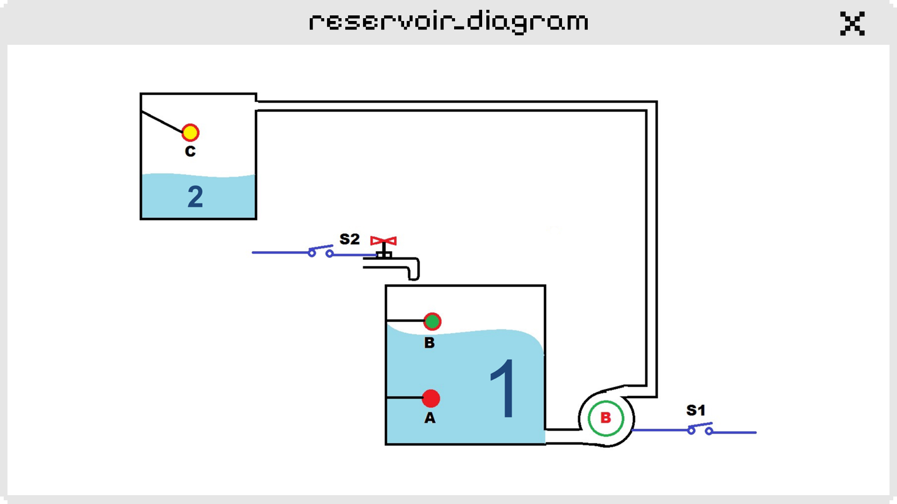

# AtividadeReservatorio
Projeto desenvolvido durante as aulas de Projeto de Interface Web do curso técnico em Informática para Internet do [SENAI-MG](https://www.fiemg.com.br/senai/). A atividade consistiu em simular um programa de controle e monitoramento do nível de água de dois reservatórios (figura abaixo), obedecendo aos seguintes critérios:

1. A bomba de água não pode funcionar com o reservatório vazio.
2. A bomba deverá ligar quando o nível de água do reservatório estiver abaixo da boia C.
3. A eletroválvula S2 irá permitir a entrada de água enquanto a boia B for acionada.
4. O sistema deverá exibir um sinal de erro quando houver inconsistência no sistema de monitoramento do reservatório 1, evitando que a bomba e a eletroválvula acionem.

A lógica de controle dos dispositivos foi baseada em uma tabela verdade que define as interações entre as variáveis de entrada e saída do sistema. Cada linha da tabela corresponde a uma combinação específica dos estados das boias (A, B, C) e seus efeitos sobre a operação da bomba (S1), da eletroválvula (S2) e a ocorrência de erros (E), sendo "0" para desligado/falso e "1" para ligado/verdadeiro:

| **A** | **B** | **C** | **S1** | **S2** | **E** |
|:-----:|:-----:|:-----:|:------:|:------:|:-----:|
| **0** | **0** | **0** |   0    |   0    |   0   |
| **0** | **0** | **1** |   0    |   0    |   1   |
| **0** | **1** | **0** |   0    |   0    |   1   |
| **0** | **1** | **1** |   0    |   0    |   1   |
| **1** | **0** | **0** |   1    |   0    |   0   |
| **1** | **0** | **1** |   0    |   0    |   1   |
| **1** | **1** | **0** |   1    |   1    |   0   |
| **1** | **1** | **1** |   0    |   1    |   0   |

## O que foi utilizado
- Linguagem: C#
- Framework: .NET
- Estrutura de controle `if-else`, laço de repetição `while` e console para entrada e saída de dados

## Etapas implementadas
- [x] Ler o estado das boias (A, B e C).
- Lógica de controle para determinar o estado da bomba e da válvula com base nas boias:
    - [x] Quando nenhuma boia está acionada, a bomba e a válvula ficam desativadas.
    - [x] Quando a boia A está acionada: liga a bomba.
    - [x] Quando as boias A e B estão acionadas: continua bombeando e abre a válvula.
    - [x] Quando todas as boias estão acionadas: desliga a bomba, mas mantém a válvula aberta.
    - [x] Se houver inconsistência, desativa a bomba e a válvula e sinaliza um erro.
- [x] Exibir o status do sistema após a leitura das boias.
- [x] Opção para o usuário realizar um novo teste ou encerrar o programa.

## Backlog
- [ ] Implementar registro de histórico das operações.

## Conclusão